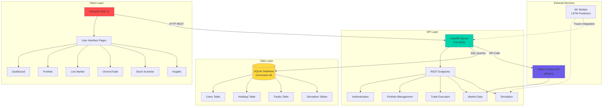
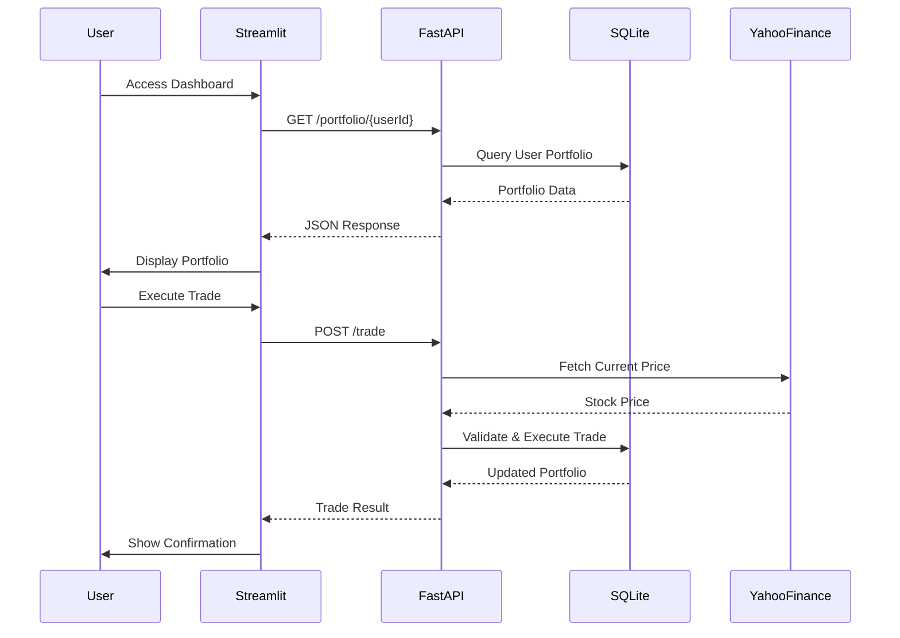
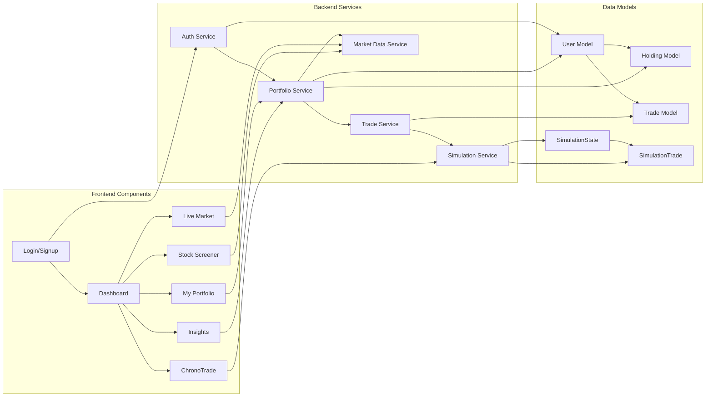
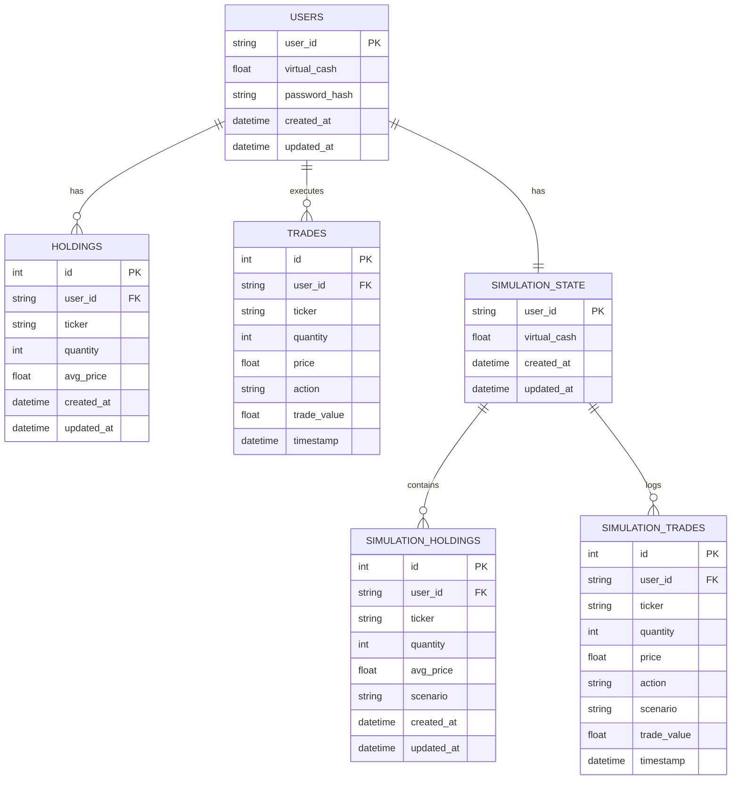
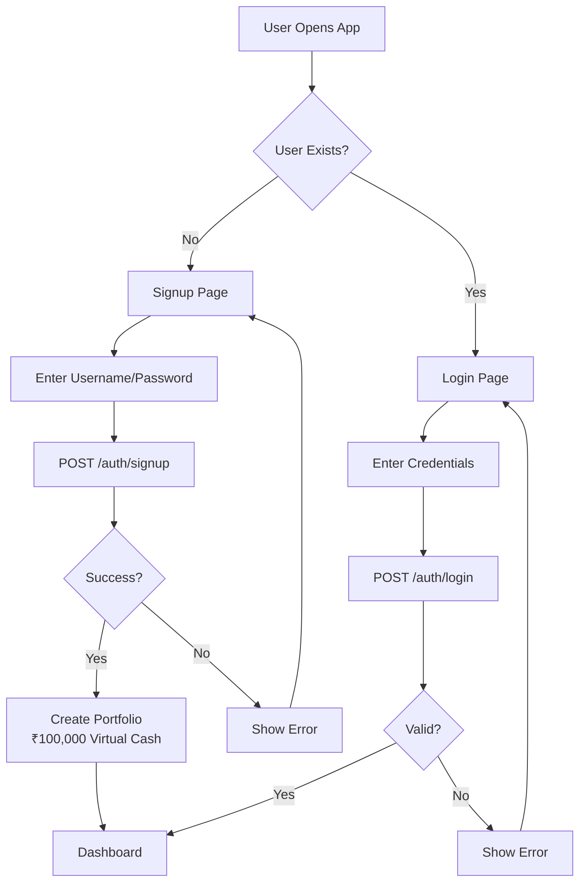
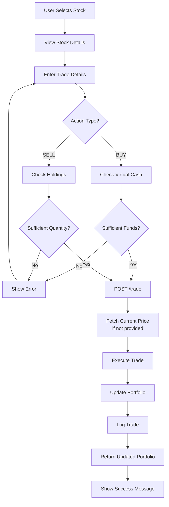

# 📈 ChronoStox - Virtual Trading Platform

<div align="center">


**A comprehensive virtual stock trading platform with real-time market data, portfolio management, and historical trading simulations**

[Features](#-key-features) • [Architecture](#-system-architecture) • [Installation](#-installation) • [API Documentation](#-api-documentation) • [Usage](#-usage)

</div>

---

## 📋 Table of Contents

- [Overview](#-overview)
- [Key Features](#-key-features)
- [System Architecture](#-system-architecture)
- [Technology Stack](#-technology-stack)
- [Installation](#-installation)
- [Database Schema](#-database-schema)
- [API Documentation](#-api-documentation)
- [User Flow](#-user-flow)
- [Project Structure](#-project-structure)
- [Development](#-development)
- [Future Enhancements](#-future-enhancements)

---

## 🎯 Overview

**ChronoStox** is a full-featured virtual trading platform that simulates real-world equity trading without financial risk. Built for educational purposes and algorithmic trading experimentation, it provides:

- **Real-time Market Data**: Live stock quotes via Yahoo Finance integration
- **Virtual Portfolio Management**: Track holdings, cash, and P&L
- **Historical Trading Simulation**: Backtest strategies using past market data
- **Stock Screening & Analysis**: Filter and analyze stocks with technical indicators
- **Market Insights**: Visualize market trends and portfolio performance

Perfect for learning trading concepts, testing strategies, and understanding market dynamics in a risk-free environment.

---

## ✨ Key Features

### 🏠 Dashboard
- **Market Overview**: Real-time view of major global indices (S&P 500, NASDAQ, Nifty 50, Sensex, etc.)
- **Portfolio Summary**: Quick glance at virtual cash, total holdings value, and P&L
- **Interactive Charts**: Visual representation of market trends and portfolio performance
- **Market Indicators**: Key metrics and market sentiment at a glance

### 💼 Portfolio Management
- **Virtual Cash**: Start with ₹100,000 virtual currency
- **Holdings Tracking**: Monitor all your stock positions with average purchase price
- **Trade History**: Complete audit trail of all buy/sell transactions
- **Real-time Valuation**: Automatic calculation of portfolio value based on current market prices

### 📊 Live Trading
- **Real-time Quotes**: Get current stock prices, volume, and market data
- **Order Execution**: Execute BUY/SELL orders with validation
- **Price Lookup**: Search and fetch data for any ticker symbol
- **Trade Validation**: Automatic checks for sufficient funds and holdings

### ⏳ ChronoTrade (Historical Simulation)
- **Time Travel Trading**: Simulate trades in historical market scenarios
- **Timeline Navigation**: Move through historical dates and execute trades
- **P&L Tracking**: Calculate profit/loss for simulation trades
- **Exportable Logs**: Download complete trade history for analysis

### 🔍 Stock Screener
- **Advanced Filtering**: Screen stocks by multiple criteria
- **Technical Indicators**: Access to various technical analysis tools
- **Custom Search**: Find stocks matching your investment criteria

### 📈 Insights & Analytics
- **Performance Metrics**: Detailed analysis of trading performance
- **Visual Analytics**: Charts and graphs for portfolio analysis
- **Market Trends**: Identify patterns and opportunities

---

## 🏗️ System Architecture

### High-Level Architecture



### Request Flow Diagram



### Component Interaction



---

## 🛠️ Technology Stack

### Frontend
- **Streamlit** - Web application framework for Python
- **Plotly** - Interactive charts and visualizations
- **Altair** - Statistical visualizations
- **Pandas** - Data manipulation and analysis

### Backend
- **FastAPI** - Modern, fast web framework for building APIs
- **SQLModel** - SQL databases in Python, designed for simplicity
- **SQLite** - Lightweight, serverless database
- **Uvicorn** - ASGI server for FastAPI

### Data & Analytics
- **yfinance** - Yahoo Finance market data downloader
- **Pandas TA** - Technical Analysis indicators
- **TensorFlow** - Machine learning framework (for LSTM models)
- **scikit-learn** - Machine learning utilities

### Security & Authentication
- **passlib** - Password hashing library
- **bcrypt** - Secure password hashing

---

## 📦 Installation

### Prerequisites

- **Python** ≥ 3.11
- **pip** (Python package manager)
- **Git** (for cloning the repository)

### Step 1: Clone the Repository

```bash
git clone https://github.com/yourusername/ChronoStox.git
cd ChronoStox
```

### Step 2: Backend Setup

```bash
# Navigate to API directory
cd api

# Create virtual environment
python -m venv .venv

# Activate virtual environment
# On Windows:
.venv\Scripts\activate
# On macOS/Linux:
source .venv/bin/activate

# Install dependencies
pip install -r requirements.txt
```

### Step 3: Frontend Setup

```bash
# Navigate back to root directory
cd ..

# Install frontend dependencies
pip install -r requirements.txt
```

### Step 4: Configure Environment (Optional)

The application uses SQLite by default, which requires no configuration. The database file (`chronostox.db`) will be created automatically on first run.

### Step 5: Run the Application

**Terminal 1 - Start Backend API:**
```bash
cd api
uvicorn main:app --reload --port 8000
```

The API will be available at:
- **API Base URL**: `http://127.0.0.1:8000`
- **Interactive API Docs**: `http://127.0.0.1:8000/docs` (Swagger UI)
- **Alternative Docs**: `http://127.0.0.1:8000/redoc` (ReDoc)

**Terminal 2 - Start Frontend:**
```bash
streamlit run Login.py
```

The application will open in your default browser at `http://localhost:8501`

---

## 🗄️ Database Schema

### Entity Relationship Diagram



### Table Descriptions

#### `users`
Stores user accounts and their virtual cash balance.
- **user_id** (Primary Key): Unique username
- **virtual_cash**: Starting balance of ₹100,000
- **password_hash**: Bcrypt hashed password
- **created_at/updated_at**: Timestamps

#### `holdings`
Tracks user's current stock positions.
- **id** (Primary Key): Auto-incrementing ID
- **user_id** (Foreign Key): References users.user_id
- **ticker**: Stock symbol (e.g., "RELIANCE.NS")
- **quantity**: Number of shares held
- **avg_price**: Weighted average purchase price

#### `trades`
Immutable log of all executed trades.
- **id** (Primary Key): Auto-incrementing ID
- **user_id** (Foreign Key): References users.user_id
- **ticker**: Stock symbol
- **quantity**: Number of shares
- **price**: Execution price
- **action**: "BUY" or "SELL"
- **trade_value**: quantity × price
- **timestamp**: Trade execution time

#### `simulation_state`
Separate portfolio state for historical simulations.
- **user_id** (Primary Key): References users.user_id
- **virtual_cash**: Simulation cash balance

#### `simulation_holdings` & `simulation_trades`
Mirror the regular holdings/trades tables but for simulation scenarios.

---

## 📡 API Documentation

### Base URL
```
http://127.0.0.1:8000
```

### Authentication Endpoints

#### `POST /auth/signup`
Register a new user account.

**Request Body:**
```json
{
  "userId": "john_doe",
  "password": "secure_password123"
}
```

**Response:**
```json
{
  "status": "success",
  "message": "Signup successful.",
  "portfolio": {
    "userId": "john_doe",
    "virtualCash": 100000.0,
    "holdings": []
  },
  "simulation": {
    "userId": "john_doe",
    "virtualCash": 100000.0,
    "holdings": []
  }
}
```

#### `POST /auth/login`
Authenticate and retrieve user portfolio.

**Request Body:**
```json
{
  "userId": "john_doe",
  "password": "secure_password123"
}
```

**Response:**
```json
{
  "status": "success",
  "message": "Login successful.",
  "portfolio": { ... },
  "simulation": { ... }
}
```

### Portfolio Endpoints

#### `GET /portfolio/{user_id}`
Retrieve user's portfolio.

**Response:**
```json
{
  "userId": "john_doe",
  "virtualCash": 95000.0,
  "holdings": [
    {
      "ticker": "RELIANCE.NS",
      "quantity": 10,
      "avgPrice": 2500.0
    }
  ]
}
```

### Trading Endpoints

#### `POST /trade`
Execute a BUY or SELL order.

**Request Body:**
```json
{
  "userId": "john_doe",
  "ticker": "RELIANCE.NS",
  "quantity": 10,
  "action": "BUY",
  "price": 2800.0
}
```

**Note:** If `price` is omitted, the API will fetch the current market price automatically.

**Response:**
```json
{
  "status": "success",
  "message": "Trade executed successfully.",
  "newPortfolio": {
    "userId": "john_doe",
    "virtualCash": 92000.0,
    "holdings": [ ... ]
  }
}
```

### Market Data Endpoints

#### `GET /stock/{ticker}`
Get current stock information.

**Example:** `GET /stock/RELIANCE.NS`

**Response:**
```json
{
  "ticker": "RELIANCE.NS",
  "currentPrice": 2800.50,
  "previousClose": 2750.00,
  "change": 50.50,
  "changePct": 1.84,
  "name": "Reliance Industries Ltd",
  "marketCap": 18950000000000,
  "sector": "Energy",
  "industry": "Oil & Gas Refining",
  "volume": 5000000,
  "avgVolume": 4500000
}
```

#### `GET /history/{ticker}`
Get historical OHLCV data.

**Query Parameters:**
- `period`: `1d`, `5d`, `1mo`, `3mo`, `6mo`, `1y`, `2y`, `5y`, `10y`, `ytd`, `max`
- `start`: Start date (YYYY-MM-DD)
- `end`: End date (YYYY-MM-DD)

**Example:** `GET /history/RELIANCE.NS?period=1mo`

**Response:**
```json
[
  {
    "time": "2024-01-01T00:00:00",
    "open": 2500.0,
    "high": 2550.0,
    "low": 2480.0,
    "close": 2520.0,
    "volume": 1000000
  },
  ...
]
```

#### `GET /indices`
Get major market indices data.

**Response:**
```json
[
  {
    "ticker": "^NSEI",
    "name": "Nifty 50",
    "region": "India",
    "lastClose": 22000.50,
    "previousClose": 21800.00,
    "change": 200.50,
    "changePct": 0.92,
    "history": [ ... ]
  },
  ...
]
```

#### `GET /tickers`
Get list of available tickers from local CSV.

**Response:**
```json
[
  {
    "Ticker": "RELIANCE.NS",
    "Name": "Reliance Industries",
    "Category": "Large Cap",
    ...
  },
  ...
]
```

### Simulation Endpoints

#### `GET /simulation/portfolio/{user_id}`
Get simulation portfolio state.

#### `POST /simulation/trade`
Execute a simulation trade.

**Request Body:**
```json
{
  "userId": "john_doe",
  "ticker": "TCS.NS",
  "quantity": 5,
  "price": 3500.0,
  "action": "BUY",
  "scenario": "2023-01-15"
}
```

#### `POST /simulation/reset/{user_id}`
Reset simulation portfolio to initial state.

#### `GET /simulation/trades/{user_id}`
Get simulation trade history.

### Health Check

#### `GET /`
API health check endpoint.

**Response:**
```json
{
  "status": "ok",
  "message": "ChronoStox API is running"
}
```

---

## 🔄 User Flow

### Registration & Login Flow



### Trading Flow



### Portfolio Management Flow

```mermaid
flowchart TD
    A[User Views Portfolio] --> B[GET /portfolio/{userId}]
    B --> C[Fetch Holdings]
    C --> D[For Each Holding]
    D --> E[GET /stock/{ticker}]
    E --> F[Calculate Current Value]
    F --> G[Calculate P&L]
    G --> H[Display Portfolio]
    H --> I[Show Total Value]
    I --> J[Show Total P&L]
```

---

## 📁 Project Structure

```
ChronoStox/
│
├── api/                          # Backend API
│   ├── __init__.py
│   ├── main.py                  # FastAPI application
│   ├── database.py              # SQLModel models & DB functions
│   ├── requirements.txt         # Backend dependencies
│   ├── env.example              # Environment variables template
│   ├── chronostox.db           # SQLite database (auto-generated)
│   └── README.md               # API-specific documentation
│
├── pages/                        # Streamlit pages
│   ├── Login.py                # Entry point & authentication
│   ├── Dashboard.py            # Main dashboard
│   ├── My_Portfolio.py         # Portfolio management
│   ├── Live_Market.py          # Real-time trading
│   ├── ChronoTrade.py          # Historical simulation
│   ├── Stock_Screener.py       # Stock filtering
│   ├── Insights.py             # Analytics & insights
│   └── Signup.py               # User registration
│
├── utils/                        # Utility modules
│   ├── __init__.py
│   ├── auth.py                 # Authentication helpers
│   └── sidebar.py              # Shared sidebar component
│
├── data/                         # Data files
│   ├── ticker.csv              # Stock ticker list
│   ├── IndianFinancialNews.csv # News data
│   └── Yahoo-Finance-Ticker-Symbols.csv
│
├── test/                         # ML & Testing
│   ├── local_cli.py            # CLI testing tools
│   ├── macro_gen.py            # Feature generation
│   ├── news_scraper.py         # News data collection
│   ├── *.keras                 # LSTM model files
│   └── *.joblib                # ML model files
│
├── ext_lib/                     # External libraries
│   └── pandas_ta-*.tar.gz      # Technical analysis library
│
├── requirements.txt             # Frontend dependencies
└── README.md                   # This file
```

---

## 💻 Development

### Running in Development Mode

Both the backend and frontend support hot-reload for development:

**Backend:**
```bash
cd api
uvicorn main:app --reload --port 8000
```

**Frontend:**
```bash
streamlit run Login.py --server.runOnSave true
```

### Code Style

- **Python**: Follow PEP 8 style guide
- **API Responses**: Use camelCase for JSON fields (e.g., `virtualCash`, `avgPrice`)
- **Error Handling**: Return appropriate HTTP status codes with descriptive messages

### Testing

Test the API endpoints using:
- **Swagger UI**: `http://127.0.0.1:8000/docs`
- **ReDoc**: `http://127.0.0.1:8000/redoc`
- **cURL** or **Postman** for manual testing

### Database Management

The SQLite database is automatically created on first run. To reset:

1. Stop the application
2. Delete `api/chronostox.db`
3. Restart the application (database will be recreated)

---

## 🚀 Future Enhancements

### Planned Features

- [ ] **User Authentication & Authorization**
  - JWT token-based authentication
  - Role-based access control
  - Session management

- [ ] **Machine Learning Integration**
  - LSTM price prediction endpoints
  - Sentiment analysis from news
  - Automated trading signals

- [ ] **Advanced Analytics**
  - Portfolio performance metrics (Sharpe ratio, beta, etc.)
  - Risk analysis and VaR calculations
  - Comparative performance charts

- [ ] **Real-time Features**
  - WebSocket support for live price updates
  - Push notifications for trade executions
  - Real-time portfolio value updates

- [ ] **Social Features**
  - Leaderboards and rankings
  - Share portfolio performance
  - Follow other traders

- [ ] **Enhanced Charting**
  - Technical indicators overlay
  - Candlestick patterns
  - Drawing tools and annotations

- [ ] **Backtesting Engine**
  - Strategy backtesting framework
  - Performance attribution analysis
  - Risk metrics calculation

- [ ] **Mobile App**
  - React Native mobile application
  - Push notifications
  - Mobile-optimized trading interface

---

## 🤝 Contributing

Contributions are welcome! Please feel free to submit a Pull Request. For major changes, please open an issue first to discuss what you would like to change.

### Contribution Guidelines

1. Fork the repository
2. Create a feature branch (`git checkout -b feature/AmazingFeature`)
3. Commit your changes (`git commit -m 'Add some AmazingFeature'`)
4. Push to the branch (`git push origin feature/AmazingFeature`)
5. Open a Pull Request

---

## 📝 License

This project is licensed under the MIT License - see the LICENSE file for details.

---

## 🙏 Acknowledgments

- **Yahoo Finance** for providing free market data via `yfinance`
- **Streamlit** team for the amazing web framework
- **FastAPI** for the high-performance API framework
- All open-source contributors and libraries used in this project

---

## 📧 Contact & Support

For questions, issues, or suggestions:
- Open an issue on GitHub
- Contact the development team

---

<div align="center">

**Built with ❤️ for traders and developers**

⭐ Star this repo if you find it useful!

</div>
